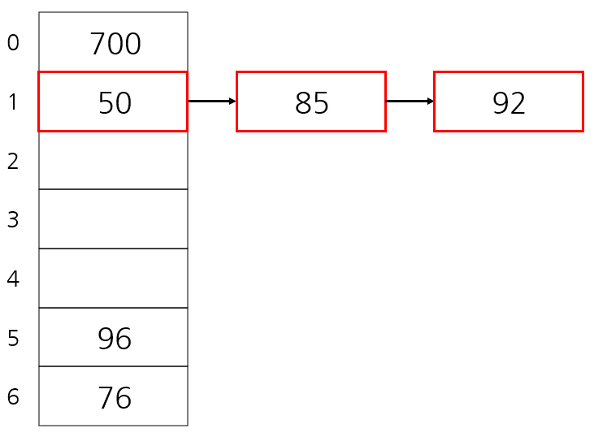
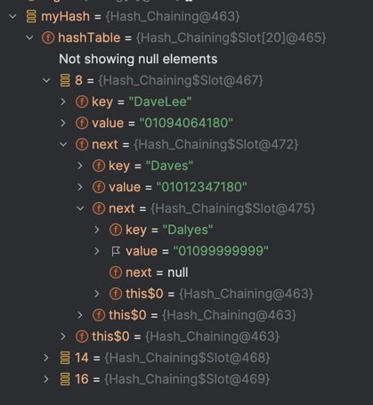
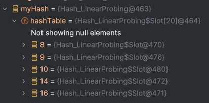

# 해시(Hash)
- 입력 데이터를 고정된 길이의 데이터로 변환된 값
- = 해시 값, 해시 코드, 체크섬
- 데이터의 Key 값이 `해시 함수`를 통해 변환된 간단한 정수
- 정수로 변환된 해시는 배열의 인덱스, 위치, 데이터 값을 저장하거나 검색할 때 활용됨

## 01. 자료구조의 특징
- 키(Key)에 데이터(Value)를 매핑할 수 있는 데이터 구조
- 해시 함수를 통해 키의 데이터를 배열에 저장할 수 있는 주소(인덱스 번호)를 계산
- 키를 통해서 저장된 데이터를 빠르게 찾고, 저장 및 탐색 속도가 획기적으로 빨라짐

## 02. 알아둘 용어
### 1) 해시 함수 (Hash Function)
> 임의의 데이터를 고정된 길이의 값으로 리턴해주는 함수

- **해시 함수는 입력받은 데이터를 해시 값으로 출력시키는 알고리즘** 
- 출력된 해시 값은 알고리즘에 따라 다양한 결과를 가짐
- 함수는 목적에 맞게 다양하게 설계되고 자료구조, 캐시, 검색, 에러 검출, 암호 등으로 유용하게 사용
```java
// 해시 함수 예시 : 이처럼 단순할 수도, 복잡할 수도 있음
Integer hashFunction(String key){
    return (int) (key.charAt(0)) % 100;
}
```

### 2) 해시 테이블 (Hash Table)
> 키 값의 연산에 의해 직접 접근이 가능한 데이터 구조
- **해시 테이블은 키와 값을 함께 저장해 둔 데이터 구조**
- 데이터가 행과 열로 구성된 표로 저장되는 것과 유사
- 테이블에 데이터를 저장할 때 위치는 `무작위`로 지정되어 중간에 여유공간 발생 가능
- `버킷` : 하나의 주소를 갖는 파일의 한 구역, 버킷의 크기는 같은 주소에 포함될 수 있는 레코드 수
- `슬롯` : 한 개의 레코드를 저장할 수 있는 공간, 한 버킷 안에 여러 개의 슬롯이 있음

## 03. 해싱 (Hashing)
해싱은 해시 함수에서 해시를 출력하고, 해시 테이블에 저장하는 과정까지의 행위


## 04. 해시 자료구조의 장, 단점과 용도
### 1) 장점
- 데이터 저장 / 읽기 속도가 빠름 (검색 속도가 빠름)
- 해시는 키에 대한 데이터가 있는지 확인이 쉬움

### 2) 단점
- 일반적으로 저장공간이 많이 필요
- 여러 키에 해당하는 주소(인덱스)가 동일한 경우 충돌을 해결하기 위한 별도 자료구조 필요

### 3) 주요 용도
- 검색이 많이 필요한 경우
- 저장, 삭제, 읽기가 빈번한 경우
- 캐쉬 구현

## 05. 해시 구현하기
- [기본적인 해시 테이블 구현](Hash.java)

---
# 충돌
- 만약 동일한 key 가 있어서 같은 값을 반환 받게 된다면?? `충돌`
- 발생 이유
  1. 함수 알고리즘의 성능이 좋지 못함
  2. 저장되는 데이터 양이 해시 테이블의 크기보다 클 때
## 01. 충돌 해결하기
해시 함수를 개선하는 방법도 있지만, 데이터가 대량으로 있을 때는 해시 함수의 성능이 정말 좋아졌는지 파악하기 어려움 `Chaining, Linear Probing` 기법으로 해결

### 1) Chaining 기법
- 개방 해싱 또는 Open Hashing 기법 중 하나 : 해시 테이블 저장공간 외의 공간을 활용하는 기법
- 충돌이 발생했을 때, 연결 리스트(Linked List) 자료구조를 사용해서 해결하는 방법
  
  - [chaining 기법 구현](Hash_Chaining.java)
    - 

### 2) Linear Probing 기법
- 폐쇄 해싱 또는 Closing Hashing 기법 중 하나 : 해시 테이블 저장공간 안에서 충돌 문제를 해결하는 기법
- 충돌이 발생했을 떄, 해당 해시 주소(index)의 다음 주소(index)부터 맨 처음까지 순회하며 빈 공간을 찾는 방식
- 저장공간 활용도를 높이기 위한 기법
- 해시 함수를 통해서 얻은 주소(index)에 이미 데이터가 있다면, 다음 주소를 체크한다. 만약 체크했을 떄 데이터가 없다면, 해당 자리에 저장이 된다
- [Linear Probing 기법 구현](Hash_LinearProbing.java)
  - 

---
# 시간 복잡도
- 충돌이 없는 일반적인 경우 O(1) : 키를 통해 바로 저장과 검색을 하여 값을 구하기 때문
- 최악의 경우, 즉 모든 index 에서 충돌이 발생할 경우 O(n) 
